# Maximizing Run:AI gains: An intro for Data Scientist  
  
**A 9-minute video presentation can be found [here](https://youtu.be/u5ePfwq5S_k).**  
  
## Intro
  
Who is this for?  
+ Data Scientist/Researchers who are now using run:ai  
  
What is it for?
+ Inform on best practices with run:ai

## What is often done
  
This graphic represents a common workflow for data scientist  
  
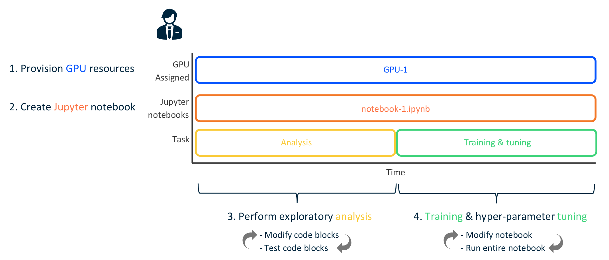  
  
This is not the best way to do things, with run:ai  
  
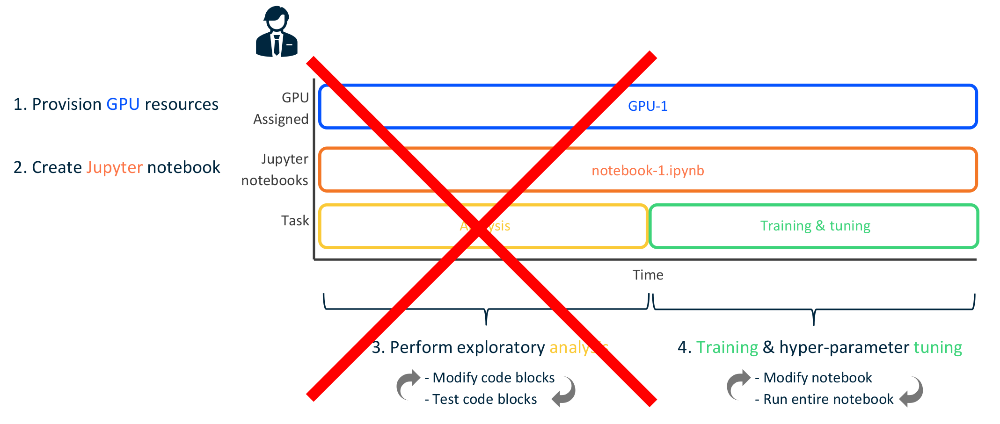  
  
## Why not to do it
  
### Understanding the goal of run:ai  
  
The run:ai software seeks to **maximize GPU utilization** (different than allocation).  
  
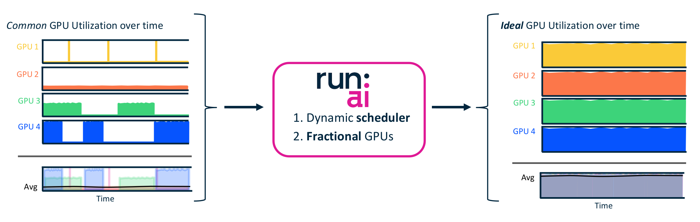  
  
### Some run:ai terminology
  
There are two types of 'jobs'  
  
For both, resources are allocated as long as the job exists  
  
**'training'** jobs
+ jobs that run until script finishes
+ will automatically stop once done
+ resources are only ties up while job is running
  
**'interactive'** jobs
+ jobs that run indefinitely
+ only stops if user deletes the job
+ **resources can be tied up forever**
  
### How common workflow can inhibit run:ai  
  
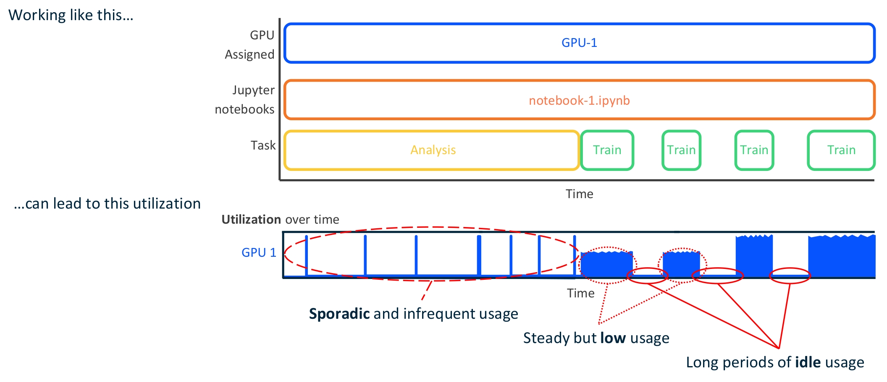  
  
## How to do it right (with run:ai)
  
### Use the run:ai **scheduler** for training, tuning, & large ETL
  
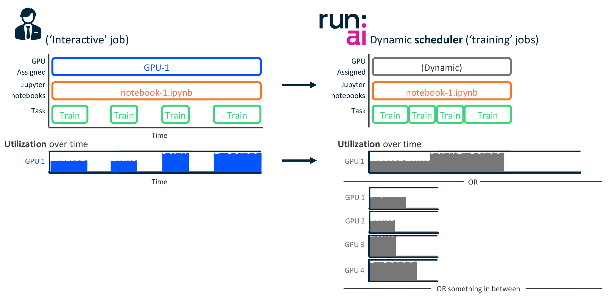
  
### Use the run:ai **fractional GPU** for analysis
  
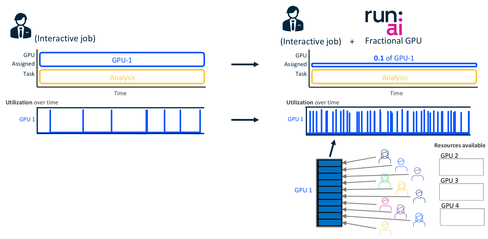
  
### Gains in GPU Utilization with run:ai
  
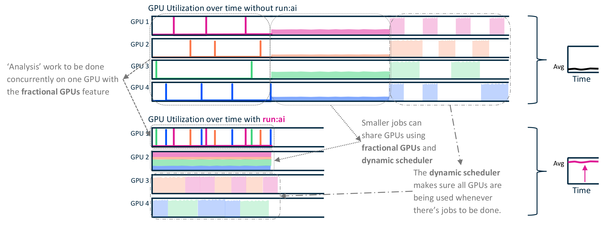
  
## Summary of run:ai best practices 
  
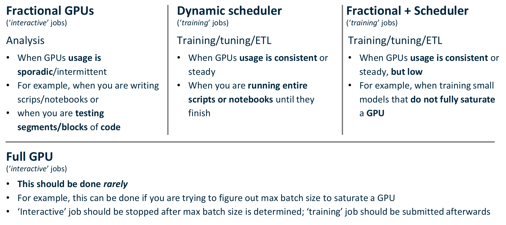
  
## Tips
  
### 1

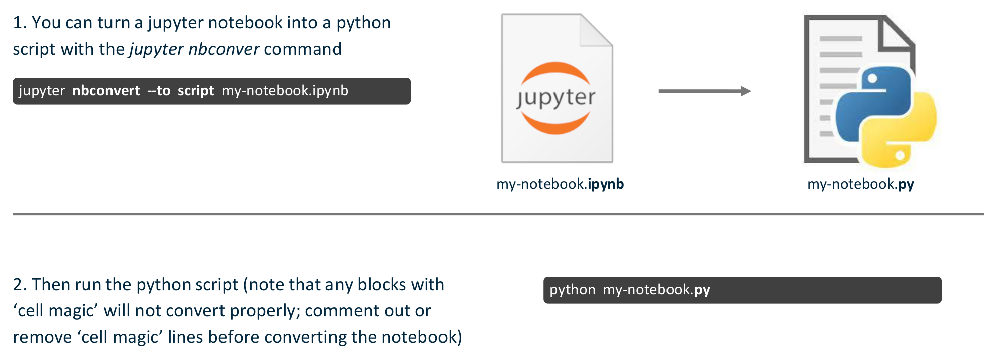
  
### 2

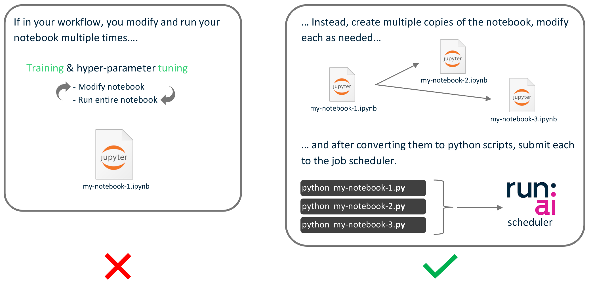
  
### 3
  
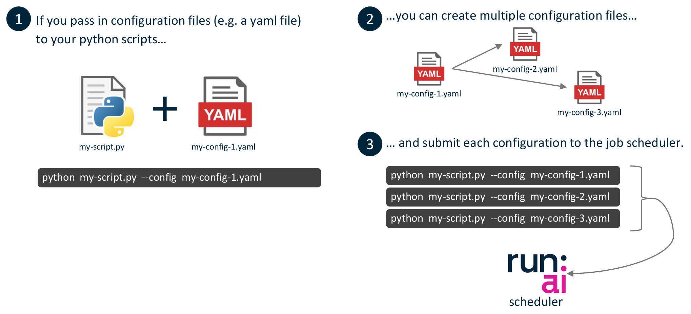